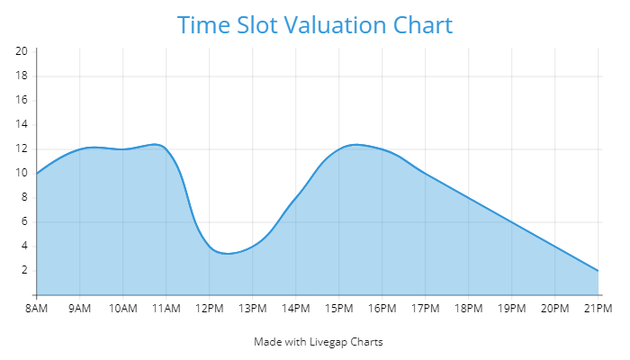

# Skedo Scheduling app

A simple scheduling application for every day use! 

Enter your tasks and availbilities to choose a schedule that fits your needs

## Installation

To run the app, first install the required dependencies by running:

### `npm install`

## Local execution
Run the app with the following command:

### `npm start`

The app will run in the development mode.

Open [http://localhost:3000](http://localhost:3000) to view it in your browser.

The page will reload when you make changes. You may also see any lint errors in the console.

## Algorithm introduction
### Principle
The scheduling works on the principle of the best First Fit. It is a greedy algorithm that uses a predifined time slot valuation grid to compare the different placements for each task. The schedule that maximizes the valuation of each task placement will be selected.

This done to favor task dispersion and minimize the chances of tasks being grouped in big groups.

### Next Steps

There are future improvements we explored and know limitations of this algorithm:

1. Include an interface for the user to define their preference for task allocation during the day. This could be done by having the user draw a chart similar to the one used by default
2. There are edge cases in which algorithm will not find a schedule. Given a group of tasks and a continous interval of time that should exactly fit all of them, it is possible that the algorithm does not return a suggested schedule. This is because the first tasks are optimally allocated in terms of value, but not in terms of placement.

### Paths to explore
A solution to the second point could be to include backtracking in the algorithm or to explore other alternatives such as Genetic Algorithms. The current algorithm was developed from scratch using concepts from greedy principles. The next step it to modify it to produce a valid schedule when one is theoretically available.

## Project designed by:
Christian Gibbs, (Documentation)

Dhiaa Naas, (Algorithm design, Unit tests)

Karim Shakil, (User Interface)

Miten Soni (User Interface, Database infrastructure)